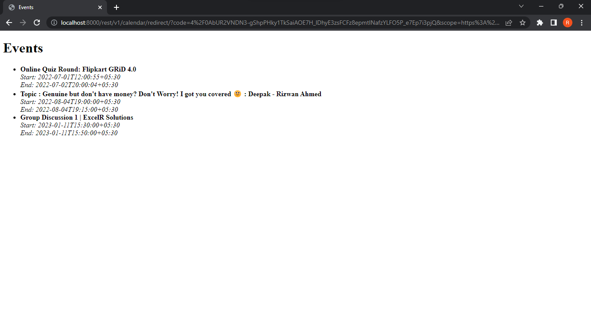

# PROBLEM:
In this assignment you have to implement google calendar
integration using django rest api. You need to use the OAuth2 mechanism to
get users calendar access. Below are detail of API endpoint and
corresponding views which you need to implement
/rest/v1/calendar/init/ -> GoogleCalendarInitView()
This view should start step 1 of the OAuth. Which will prompt user for
his/her credentials
/rest/v1/calendar/redirect/ -> GoogleCalendarRedirectView()
This view will do two things
1. Handle redirect request sent by google with code for token. You
need to implement mechanism to get access_token from given
code
2. Once got the access_token get list of events in users calendar
You need to write the code in Django. You are not supposed to use any
existing third-party library other then google’s provided standard libraries

## Getting Started
1. Clone the repository
```bash
git clone https://github.com/rizwanahmedit23/google_calendar.git
```
2. Open project directory and start terminal if you are using VS Code or move to the project directory.
```bash
cd GoogleCalendarIntegration
```
3. Create an environment and install required modules from 'requirements.txt' file:
```bash
pip install -r requirements.txt
```
4. .Go to https://console.cloud.google.com/ and get Get OAuth 2.0 Credentials i.e. OAuth2 client ID, client secret, and redirect URI from the 'Google Calendar API'. 
Replace them with the actual values from your Google API credentials.

5. Move to the `google_calendar_integration` directory and update the constants in 'views.py' file with your google credentials as shown below:
GOOGLE_OAUTH2_CLIENT_ID = "your-client-id"
GOOGLE_OAUTH2_CLIENT_SECRET = "your-client-secret"
GOOGLE_OAUTH2_REDIRECT_URI = "http://your-redirect-uri"

The redirect uri should look like: http://localhost:8000/rest/v1/calendar/redirect/ if you are using a local host

6. Run the server
```bash
python manage.py runserver
```
7. Open the endpoint link in the browser:
```bash
http://localhost:8000/rest/v1/calendar/init/
```
## API Endpoints
1. Initialize Google Calendar Integration
- Endpoint: `/rest/v1/calendar/init/`
- View: `GoogleCalendarInitView`

This endpoint starts step 1 of the OAuth2 process. It gets the user's credentials and saves the state so the callback can verify the auth server response.


2. Handle redirect from Google OAuth2 and get list of events from user's calendar
- Endpoint: `/rest/v1/calendar/redirect/`
- View: `GoogleCalendarRedirectView`

This endpoint handles redirect request sent by google, fetched the access token and then gets a list of events from user's calendar. <br>

## Output
The events are rendered in a simple HTML page. The output is shown below: 
<br>


